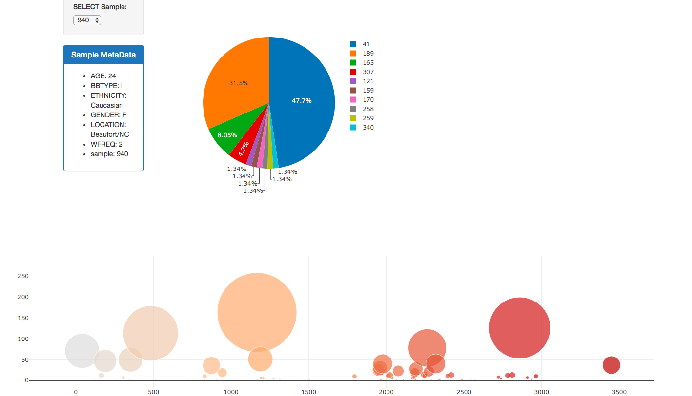

# Belly Button Biodiversity

Building an interactive dashboard to explore the [Belly Button Biodiversity DataSet](http://robdunnlab.com/projects/belly-button-biodiversity/).

## Flask API

Used Flask API to serve the data needed for the plots.

## Plotly.js

Used Plotly.js to build interactive charts for the dashboard.

* PIE chart that uses data from the samples route (`/samples/<sample>`) to display the top 10 samples.

  

* Bubble Chart that uses data from the samples route (`/samples/<sample>`) to display each sample.

  

* Displayed the sample metadata from the route `/metadata/<sample>`

    
  

* Updated all of the plots any time that a new sample is selected.

## Heroku

Link to deployed project: https://bellybutton-bd.herokuapp.com/